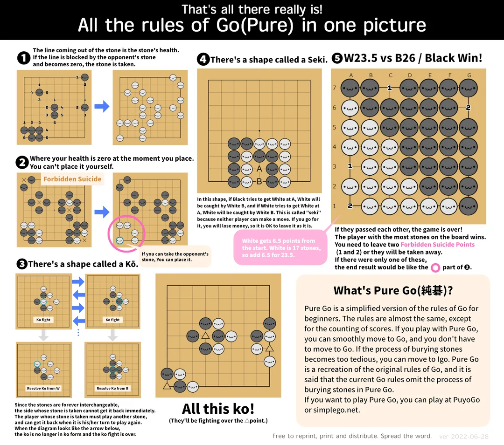

# gogol
The game of GO in Golang

# Go rules

We will base our game on those go rules :



This image was taken from : https://www.reddit.com/r/baduk/comments/vn936i/i_have_created_an_image_to_help_you_understand/


# TODO

[ ] Optimize the group merging
[ ] Add the KO rule detection using the zobrist hash
[ ] Add the winning condition (to be determined)
[ ] Add more depth to the OpenAI query like the difficulty, ...
[ ] Make the interface more beautiful
[ ] Add the pipeline in Github for tests, linting, ...
[ ] Publish on the github pages

# Project structure

In this project, there are multiple packages that each serve a distinct purpose :

- game : Manages the game logic with the board, the stones, ...
- renderer : Manages the rendering of the game
- bot : Manages the bot that plays against the player
- main : Entry point of the application

## Game

In the game package, we've split the logic into multiple files :

- board : this file manages the board and how the stones are placed on it. This means that it handles the placement of the stones, the groups, the liberties AND handles the group deletion when a group has no liberties left.
- game : this file is a sort of controller that makes the link between the board and the renderer. It is responsible for updating the board and the renderer when a stone is placed. It doesn't handle the stones, groups, liberties, ...
- types : this files defines the types used in the game like the stones, the groups, the player, ... (the board type is defined in the board.go file)

## Renderer

The renderer package is responsible for rendering the game. It uses the ebiten library to render the game.

## Bot

The bot package is responsible for playing against the player. It uses the OpenAI API to get the next move. It sends the full board as text to the API and gets the coordinates of the next move.

# How to run the game

To run the game, you need to have go installed on your system.

Then, you can run the game by running the following command :

```bash
go run main.go
```

# How to build the game

To build the game, you can run the following command :

```bash
go build main.go
```

