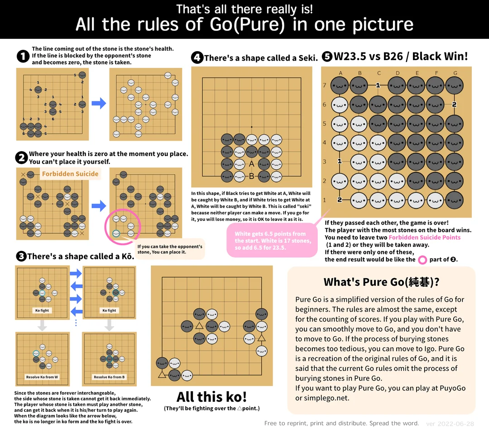

# GoGol

A Go game implementation in Go, developed as part of the course "Programmation élégante en Go" at the Haute école d'ingénierie et d'architecture de Fribourg (HEIA-FR).

## Authors

- **Ding Lionel** - lionel.ding@hes-so.ch
- **Darx Christian** - christia.darx@hes-so.ch

## Description

GoGol is an implementation of the board game Go (also known as Baduk) featuring:

- Complete game logic with stone placement, group management, and liberty tracking
- Player versus Player (PvP) and Player versus Environment (PvE) game modes
- AI opponent powered by a Multi-Layer Perceptron (MLP) neural network
- Graphical user interface built with Ebiten
- WebAssembly support for browser-based gameplay

## Go Rules

The game follows the standard rules of Go. The following image provides an overview of the basic rules:



## Project Structure

```
gogol/
├── ai/          # AI player implementation and MLP neural network
├── assets/      # Embedded game assets (images, models)
├── game/        # Core game logic (board, groups, rules)
├── ui/          # User interface and rendering
└── main.go      # Application entry point
```

## Prerequisites

- Go 1.24.0 or later
- Git (for cloning the repository)

## Building and Running

### From Source

```bash
# Clone the repository
git clone https://github.com/cdarx4/gogol
cd gogol

# Run the game
go run main.go

# Build the executable
go build -o gogol main.go
```

### Running Tests

```bash
go test ./...
```

## Dependencies

- [Ebiten v2](https://github.com/hajimehoshi/ebiten) - 2D game library for Go

## License

This project is licensed under the Apache License 2.0. See the file headers in the source code for details.
